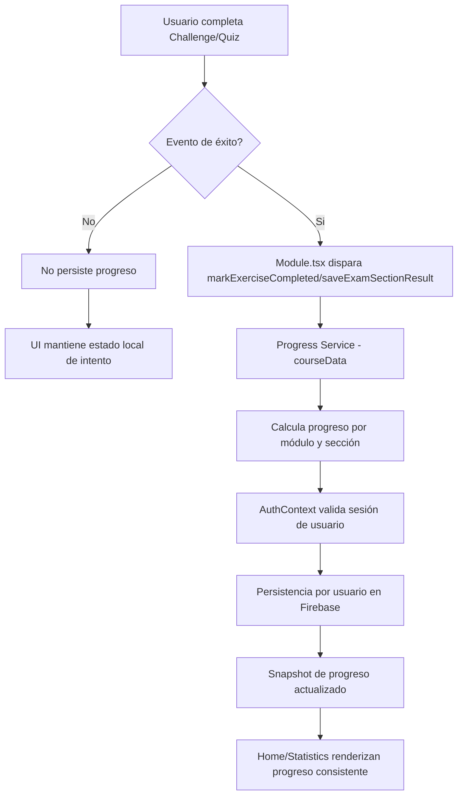

# Discrete Math Academy


Plataforma educativa interactiva optimizada para aprendizaje de Matemática Discreta, con enfoque pedagógico basado en progreso verificable y arquitectura de software desacoplada. El proyecto combina una experiencia didáctica de alto rendimiento con decisiones técnicas orientadas a escalabilidad, integridad de datos y mantenibilidad a largo plazo.

**Live Demo:** [math.alvy.site](https://math.alvy.site)

## Value Proposition

Discrete Math Academy integra teoría, aplicaciones y evaluaciones interactivas en una experiencia guiada por resultados. A nivel técnico, el MVP está diseñado para evolucionar con bajo costo de cambio: contenido desacoplado por dominio, tipado compartido para consistencia transversal y reglas de persistencia orientadas a eventos de éxito en lugar de navegación superficial.

## Architecture & Design Decisions

### Domain-Driven Content

El contenido académico se modela de forma desacoplada en archivos JSON bajo `client/src/data/modules`, separados de la lógica de presentación y de la capa de estado.

Esto habilita:
- Evolución curricular sin reescribir componentes de UI.
- Versionado de contenido por módulo/sección con trazabilidad clara.
- Escalado hacia internacionalización o pipelines editoriales sin acoplar el dominio al framework.

### Shared Type System

La integridad de datos se asegura mediante un sistema de tipos compartido:
- Tipos de dominio educativo en `client/src/types/course.ts`.
- Tipos transversales de progreso/estadísticas en `shared/types.ts`.

Este enfoque reduce deriva de contratos entre capas y permite refactors seguros, especialmente en:
- Progreso por módulo.
- Resultados de evaluación.
- Estructuras de usuario y métricas agregadas.

### Success-Based Persistence

La completitud no se dispara por visita de pantalla, sino por eventos de aprobación verificables.

Regla arquitectónica:
- `Challenge`: persiste solo si la respuesta es correcta.
- `Quiz`: persiste solo al cumplir el umbral de aprobación.
- Navegar entre ejercicios no incrementa progreso por sí mismo.

Razón técnica y de producto:
- Evita inflar métricas de aprendizaje.
- Aumenta la calidad de analítica y recomendaciones.
- Alinea la persistencia con evidencia real de dominio adquirido.

### Flujo de Persistencia (Mermaid)



## Tech Stack

- React 19
- Vite 7
- TypeScript (strict)
- Tailwind CSS
- shadcn/ui
- KaTeX
- Recharts
- Firebase Authentication

## Local Setup & Quality Gates

### Requisitos

- Node.js 20+
- pnpm 10+

### Instalación

1. Instalar dependencias.

```bash
pnpm install
```

2. Crear archivo de entorno local desde plantilla.

```bash
cp .env.example .env
```

PowerShell:

```powershell
Copy-Item .env.example .env
```

3. Configurar valores en `.env`.

4. Iniciar entorno de desarrollo.

```bash
pnpm dev
```

5. Ejecutar validación de calidad tipada.

```bash
pnpm check
```

## Variables de Entorno

El proyecto incluye un `.env.example` completo para acelerar onboarding técnico.

| Variable | Requerida | Propósito |
| --- | --- | --- |
| `VITE_FIREBASE_API_KEY` | Sí | Credencial pública del proyecto Firebase |
| `VITE_FIREBASE_AUTH_DOMAIN` | Sí | Dominio de autenticación Firebase |
| `VITE_FIREBASE_PROJECT_ID` | Sí | Identificador del proyecto |
| `VITE_FIREBASE_STORAGE_BUCKET` | Sí | Bucket para almacenamiento asociado |
| `VITE_FIREBASE_MESSAGING_SENDER_ID` | Sí | Identificador de mensajería |
| `VITE_FIREBASE_APP_ID` | Sí | Identificador de aplicación Firebase |
| `VITE_FIREBASE_MEASUREMENT_ID` | No | Integración de medición/analytics Firebase |
| `VITE_ANALYTICS_ENDPOINT` | No | Endpoint de analítica (Umami compatible) |
| `VITE_ANALYTICS_WEBSITE_ID` | No | Sitio objetivo para analítica |
| `VITE_FRONTEND_FORGE_API_URL` | No | URL base para integración de mapas/forge |
| `VITE_FRONTEND_FORGE_API_KEY` | No | API key para servicios de mapas/forge |

## Security

- Los secretos no se versionan; se gestionan mediante variables de entorno por entorno de ejecución.
- El repositorio mantiene plantilla segura en `.env.example` sin exponer credenciales productivas.
- En Firebase, las reglas deben restringir lectura/escritura por identidad autenticada y alcance de datos de usuario.
- Se recomienda auditar historial Git antes de releases para prevenir exposición accidental de secretos.

## Author

**Ignacio Jofré Guerra**
*Full-Stack Architect & CTO*
[LinkedIn](https://www.linkedin.com/in/ignacio-jofre-guerra/) | [GitHub](https://github.com/IgnacioJofreGuerra)